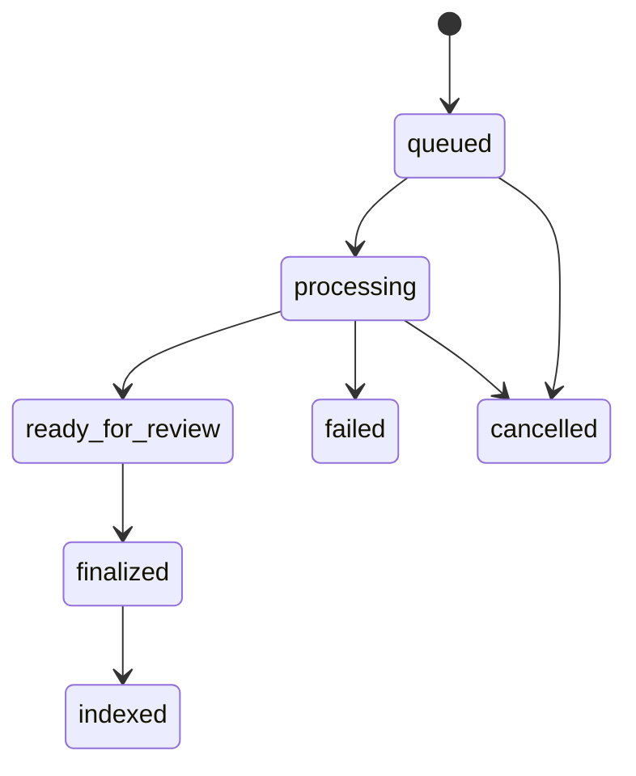

# REST API Overview

The LongParser REST server provides a full HTTP API for document processing, HITL review, and chat.

## Base URL

```
http://localhost:8000
```

## Authentication

All endpoints require an API key in the `X-API-Key` header:

```bash
curl -H "X-API-Key: your-api-key" http://localhost:8000/jobs
```

Set the key via `LONGPARSER_API_KEY` environment variable.

## Interactive Docs

Visit the built-in Swagger UI:

```
http://localhost:8000/docs
```

Or ReDoc:

```
http://localhost:8000/redoc
```

## Core Endpoints

| Method | Path | Description |
|---|---|---|
| `POST` | `/jobs` | Upload a document and start processing |
| `GET` | `/jobs/{job_id}` | Get job status and metadata |
| `DELETE` | `/jobs/{job_id}` | Delete a job and its data |
| `POST` | `/jobs/{job_id}/cancel` | Cancel an in-progress job |
| `GET` | `/jobs/{job_id}/blocks` | List extracted blocks |
| `PATCH` | `/jobs/{job_id}/blocks/{block_id}` | Review/edit a block |
| `GET` | `/jobs/{job_id}/chunks` | List chunks |
| `PATCH` | `/jobs/{job_id}/chunks/{chunk_id}` | Review/edit a chunk |
| `POST` | `/jobs/{job_id}/rechunk` | Manually trigger re-chunking |
| `POST` | `/jobs/{job_id}/finalize` | Finalize review |
| `POST` | `/jobs/{job_id}/embed` | Embed chunks into vector store |
| `GET` | `/jobs/{job_id}/export` | Download finalized output as .zip |
| `GET` | `/jobs/{job_id}/audit` | Get revision audit trail |
| `POST` | `/search` | Semantic search |
| `POST` | `/chat/sessions` | Create chat session |
| `GET` | `/chat/sessions/{session_id}` | Get session + history |
| `POST` | `/chat` | Ask a question |
| `POST` | `/chat/resume` | Resume HITL-paused chat |
| `GET` | `/health` | Health check |

## Job Lifecycle


