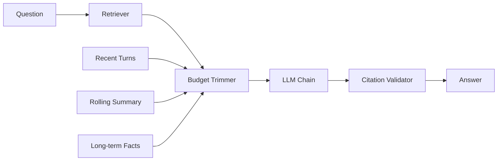

# Chat Engine

The LongParser chat engine provides **RAG-powered Q&A** with a 3-layer memory system (recent turns, rolling summary, long-term facts).

## Architecture



## Session Management

```bash
# Create a session
POST /chat/sessions
{
  "job_id": "abc123"
}
# Returns: { "session_id": "...", "job_id": "..." }

# Get session history
GET /chat/sessions/{session_id}
```

## Ask a Question

```bash
POST /chat
{
  "session_id": "sess_xyz",
  "job_id": "abc123",
  "question": "What are the key findings?",
  "config": {
    "llm_provider": "openai",
    "llm_model": "gpt-5.3",
    "top_k": 5
  }
}
```

## Memory Layers

| Layer | Description | Scope |
|---|---|---|
| **Recent turns** | Last N questions + answers | Short-term (trimmed to token budget) |
| **Rolling summary** | LLM-condensed conversation summary | Medium-term (grows with conversation) |
| **Long-term facts** | Extracted persistent facts | Long-term (across sessions) |

## Citation Validation

Every answer's `cited_chunk_ids` are validated against the retrieved set. IDs not present in the retrieval results are stripped automatically — preventing hallucinated citations:

```python
# If LLM cites chunk-999 but only chunk-1, chunk-2 were retrieved:
# → chunk-999 is removed
# → if all citations stripped + no docs retrieved:
#   answer → "I don't have enough information..."
```

## LLM Providers

| Provider | Key |
|---|---|
| OpenAI | `OPENAI_API_KEY` |
| Google Gemini | `GOOGLE_API_KEY` |
| Groq | `GROQ_API_KEY` |
| OpenRouter | `OPENROUTER_API_KEY` |
