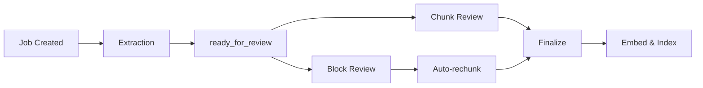

# Human-in-the-Loop (HITL) Review

LongParser's HITL layer lets human reviewers inspect, edit, approve, or reject extracted content before it is indexed in a vector store.

## Workflow



## Review Statuses

Each block and chunk has an independent review status:

| Status | Meaning |
|---|---|
| `pending` | Not yet reviewed |
| `approved` | Accepted as-is |
| `edited` | Content modified by reviewer |
| `rejected` | Excluded from final output |

## Reviewing Blocks

```bash
# List blocks for a job
GET /jobs/{job_id}/blocks?status=pending&page=1

# Approve a block
PATCH /jobs/{job_id}/blocks/{block_id}
{
  "status": "approved",
  "version": 1
}

# Edit and approve a block
PATCH /jobs/{job_id}/blocks/{block_id}
{
  "status": "edited",
  "edited_text": "Corrected text here.",
  "reviewer_note": "Fixed OCR error",
  "version": 1
}
```

After any block edit, chunks are **automatically re-generated** from the updated blocks.

## Finalize Policies

```bash
POST /jobs/{job_id}/finalize
{
  "finalize_policy": "require_all_approved"
}
```

| Policy | Behaviour |
|---|---|
| `require_all_approved` | Blocks if any item is still pending |
| `auto_approve_pending` | Auto-approves remaining pending items |
| `auto_reject_pending` | Auto-rejects remaining pending items |

## Audit Trail

Every action is recorded in an append-only audit trail:

```bash
GET /jobs/{job_id}/audit
```

Returns all revisions with timestamps, reviewer notes, and previous/current text.

## HITL Chat (require_approval)

The chat engine also supports HITL — holding LLM answers for review before delivery:

```bash
POST /chat
{
  "session_id": "...",
  "job_id": "...",
  "question": "Summarise the key findings.",
  "require_approval": true
}
# Returns: { "status": "pending_review", "thread_id": "..." }

POST /chat/resume
{
  "thread_id": "...",
  "session_id": "...",
  "action": "edit",
  "edited_answer": "The key findings are..."
}
```
